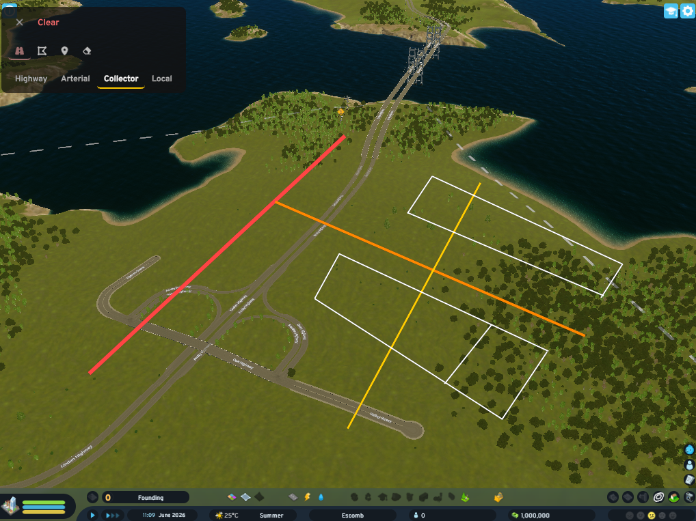

# skyplan

**Cities: Skylines II mod** — in-game SVG drawing overlay for city planning.

Tracing paper over your city map, but inside CS2. Draw road networks, zoning, districts, and transit lines on top of the live game map before committing anything.

## Features

- Draw tools: line, rect, circle, freehand
- Erase tool with hover highlight
- 4 layers: Roads / Zoning / Transit / Notes (each with its own colour)
- Draggable toolbar
- World-space coordinates — shapes stay aligned as the camera pans and zooms
- Undo stack (Ctrl+Z)
- Clear layer

## Architecture

Two projects, one `dotnet build`:

```
skyplan/                        # C# mod (UISystemBase ECS system)
  Mod.cs                        # IMod entry, registers keybinding (Alt+P)
  Setting.cs                    # Options UI + rebindable shortcut
  Systems/DrawingSystem.cs      # Binding host, drawing logic, world↔screen math
  skyplan.csproj                # Builds C# + triggers npm build for SkyPlanUI

SkyPlanUI/                      # React/TSX UI mod (Coherent GameFace)
  src/
    index.tsx                   # Mod registrar — appends SkyplanOverlay to 'Game' hook
    bindings.ts                 # bindValue subscriptions (C# → UI)
    mods/SkyplanOverlay.tsx     # Main overlay component
  mod.json                      # id: "skyplan" — must match C# mod folder
  webpack.config.js             # Outputs skyplan.mjs to Mods/skyplan/
```

### C# ↔ UI binding system

Uses CS2's ECS binding infrastructure (`Colossal.UI.Binding`), not raw Coherent events.

```
C# ValueBinding<T>("skyplan", "panelVisible", ...)  →  bindValue<boolean>('skyplan', 'panelVisible', false)
C# TriggerBinding<string>("skyplan", "drawStart", …) ←  trigger('skyplan', 'drawStart', `${x},${y}`)
```

C# calls `.Update(value)` to push; React reads via `useValue(binding$)`.

### Layer colours

| Layer   | Stroke    |
|---------|-----------|
| Roads   | `#ff4444` |
| Zoning  | `#44dd44` |
| Transit | `#4488ff` |
| Notes   | `#ffcc00` |

## Build

Requires Windows + PDX Modding Toolchain installed in-game (CS2 → Mods → Install Modding Toolchain).

```
dotnet build
```

This single command:
1. Runs `npm run build` in `SkyPlanUI/` (webpack → `Mods/skyplan/skyplan.mjs`)
2. Compiles `skyplan.dll`
3. Runs `ModPostProcessor.exe` → `skyplan_win_x86_64.dll`
4. Deploys both DLLs to `%CSII_LOCALMODSPATH%\skyplan\`

## Logs

```
%AppData%\..\LocalLow\Colossal Order\Cities Skylines II\Logs\skyplan.Mod.log
%AppData%\..\LocalLow\Colossal Order\Cities Skylines II\Logs\UI.log
```

## Usage

Load a city → press **Alt+P** (rebindable in Options → Key Bindings).



## What's next

- Persist drawings to JSON on save/load
- Camera drag restore while panel is open
- Terrain snapping (snap to roads, zone grid)
- Export SVG
