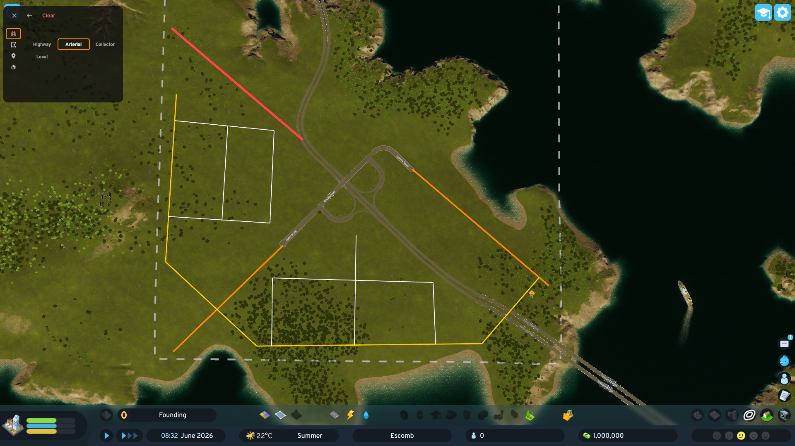
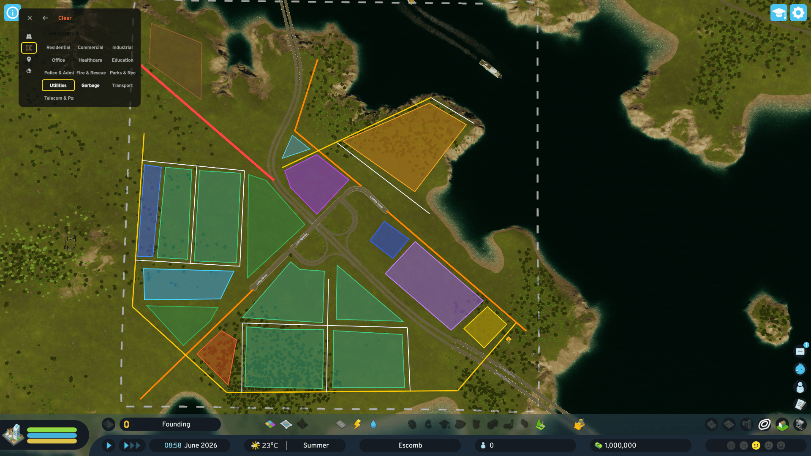
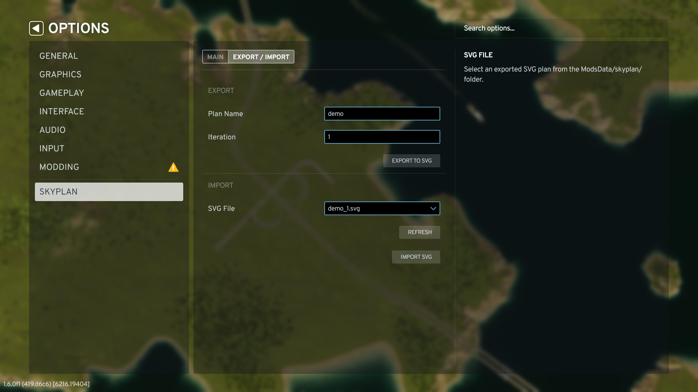

# skyplan

**Cities: Skylines II mod** — in-game SVG drawing overlay for city planning.

Tracing paper over your city map, but inside CS2. Draw road networks, zoning, districts, and transit lines on top of the live game map before committing anything.

## Usage

Load a city → press **Alt+P** (rebindable in Options → Key Bindings).

Plan your roads with line tool



Plan your land usage with polygon tool



Import and Export the SVGs



## Features

- Draw tools: line, polygon, point
- Erase tool with hover highlight
- **24 built-in layers** across Transit, Roads, Zones, Public Services, and Points of Interest — fully customisable via `layers.json`
- Draggable toolbar
- World-space coordinates — shapes stay aligned as the camera pans and zooms
- Undo stack (Ctrl+Z)
- Clear layer

### Customising layers (`layers.json`)

Layer definitions live in `SkyPlanUI/src/layers.json` and are deployed to the mod folder on every build. On first panel open, the file is seeded to:

```
%AppData%\..\LocalLow\Colossal Order\Cities Skylines II\ModsData\skyplan\layers.json
```

Edit that file to customise colours, add layers, or remove ones you don't need. Changes take effect the next time you open the panel (hot-swap — no rebuild required).

#### Schema

```jsonc
{
  "version": "...",       // auto-patched by version.ps1 on every build
  "layers": [
    {
      "id": "my-layer",          // unique identifier, used internally
      "label": "My Layer",       // displayed in the toolbar
      "allowedTools": ["line"],  // which tools show this layer: "line" | "polygon" | "point"
      "style": {
        // any valid SVG presentation attribute is accepted, e.g.:
        "stroke": "#ff4444",
        "strokeWidth": 3,
        "strokeDasharray": "8 4",
        "strokeLinecap": "round",
        "fill": "#ff4444",
        "fill-opacity": "0.5",
        "opacity": "0.8"
      }
    }
  ]
}
```

Any SVG presentation attribute is valid inside `style` — `stroke-dasharray`, `opacity`, `fill-rule`, etc. String and number values are both accepted.

#### Built-in layers

| Category | Layer | Tool | Colour |
|---|---|---|---|
| Roads | Highway | line | `#ff4444` |
| Roads | Arterial | line | `#ff8800` |
| Roads | Collector | line | `#ffcc00` |
| Roads | Local | line | `#ffffff` |
| Zones | Residential | polygon | `#44cc88` |
| Zones | Commercial | polygon | `#4488ff` |
| Zones | Industrial | polygon | `#ffaa22` |
| Zones | Office | polygon | `#cc88ff` |
| Services | Healthcare | polygon | `#ff4488` |
| Services | Education | polygon | `#44ddff` |
| Services | Police & Admin | polygon | `#3366ff` |
| Services | Fire & Rescue | polygon | `#ff6622` |
| Services | Parks & Rec | polygon | `#33bb55` |
| Services | Utilities | polygon | `#ffdd00` |
| Services | Garbage | polygon | `#996633` |
| Services | Transport | polygon | `#cc44ff` |
| Services | Telecom & Post | polygon | `#66cccc` |

## Build

Requires Windows + PDX Modding Toolchain installed in-game (CS2 → Mods → Install Modding Toolchain).

First-time setup:

```
dotnet tool restore
cd .\SkyPlanUI\
npm install
```

Then on every build:

```
dotnet build  .\skyplan\skyplan.csproj
```

This single command:
1. Runs `npm run build` in `SkyPlanUI/` (webpack → `Mods/skyplan/skyplan.mjs`)
2. Compiles `skyplan.dll`
3. Runs `ModPostProcessor.exe` → `skyplan_win_x86_64.dll`
4. Deploys both DLLs to `%CSII_LOCALMODSPATH%\skyplan\`
5. Deploys `layers.json` to `%CSII_LOCALMODSPATH%\skyplan\`

## Logs

```
%AppData%\..\LocalLow\Colossal Order\Cities Skylines II\Logs\skyplan.Mod.log
%AppData%\..\LocalLow\Colossal Order\Cities Skylines II\Logs\UI.log
```

## What's next

- Terrain snapping (snap to roads, zone grid)
