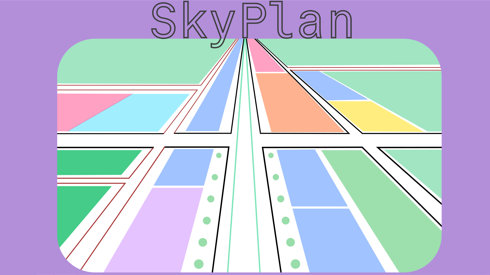

# skyplan

**Cities: Skylines II mod** — in-game SVG drawing overlay for city planning.



Tracing paper over your city map, but inside CS2. Draw road networks, zoning, transit lines, curves, and points of interest on top of the live game map before committing anything.

## Usage

Load a city, press **Alt+P** (rebindable in Options > Key Bindings).

Left-click to start drawing, right-click to end the drawing.

- **Lines** - left-click starts a new segment from the end of the previous one.
- **Polygons** - left-click adds a point, right-click closes the shape.
- **Curves** - left-click alternates between anchor and control points, right-click ends the shape.
- **Points** - left-click drops a circle (with an optional custom icon) on the map.
- **Annotation** - click to preview a point, type in the toolbar's text field, press **Enter** to place the label.

Right-click a selected tool or layer in the toolbar to deselect it.

## Disclaimer

This is a beta version - a lot of the feedback I got on Reddit isn't implemented yet. Even the thumbnail is under development.

## Experimental Features

- **Planning Tools**
  - `ServiceCatchmentSystem`: while the Skyplan panel is open, clicking a school or hospital shows where its students/patients live.

## Features

- Line, polygon, curve, point, and annotation drawing tools: plan roads, mark zones, drop points of interest
- **38 built-in layers** - Transit (Train, Subway, Tram, Bus), Roads (Highway to Local), Zones (Residential incl. Low/Medium/High/Mixed-Use, Commercial incl. High, Industrial, Office), Public Services, and Points of Interest (incl. custom icons), each with its own colour and style
- Multi-layer parallel corridors: queue multiple layers in the toolbar (Shift+click) and draw once to get parallel lanes in that exact order, for both lines and curves. Adjust spacing live with Shift+scroll wheel
- Custom icons for point layers: define `icon: {path, color}` per layer in `layers_default.json`, rendered in-game and in SVG export/import
- Snapping: lines and polygons snap to existing shapes, with an indicator shown on hover
- World clicks (building select/placement) blocked while in Draw mode by default, so a draw click doesn't also interact with the game underneath (toggleable in mod settings)
- Fully customisable layers: edit `layers_default.json` to add, remove, or restyle any layer. Changes hot-swap without a game restart
- World-space coordinates: shapes stay pinned to the map as you pan and zoom
- Erase tool with hover highlight
- SVG export and import: save your plans as standard SVG files, open them in Inkscape, share them, or import them back later
- Auto Save/Load: the game auto-saves your shapes per city and loads them on start
- Undo/Redo: (Ctrl+Z)/(Ctrl+Y)
- Draggable toolbar
- Shape Manager: view all shapes grouped by layer, edit each shape's name and description, toggle layer visibility and label display
- Canvas labels: shape names can be toggled to appear on the map at the shape's anchor point
- Visual: global and per-layer opacity sliders
- Per-layer visibility toggle
- Deselect active tool/layer with right-click

### Customising layers (`layers_default.json`)

Layer definitions live in `SkyPlanUI/src/layers_default.json` and are deployed to the mod folder on every build. On first panel open, the file is seeded to:

```
%AppData%\..\LocalLow\Colossal Order\Cities Skylines II\Mods\skyplan\layers_default.json
```

Edit that file to customise colours, add layers, or remove ones you don't need. Changes take effect the next time you open the panel (hot-swap - no rebuild required).

#### Schema

```jsonc
{
  "version": "...",       // auto-patched by version.ps1 on every build
  "layers": [
    {
      "id": "my-layer",          // unique identifier, used internally
      "label": "My Layer",       // displayed in the toolbar
      "allowedTools": ["path"],  // which tools show this layer: "path" | "polygon" | "curve" | "point" | "text"
      "style": {
        // any valid SVG presentation attribute is accepted, e.g.:
        "stroke": "#ff4444",
        "strokeWidth": 3,
        "strokeDasharray": "8 4",
        "strokeLinecap": "round",
        "fill": "#ff4444",
        "fill-opacity": "0.5",
        "opacity": "0.8"
      },
      "icon": {                  // optional, point layers only
        "path": "M-4,-4 L4,-4 ...",  // SVG path data, authored in roughly -4..4 local space
        "color": "#000000"           // optional, defaults to black
      }
    }
  ]
}
```

Any SVG presentation attribute is valid inside `style` - `stroke-dasharray`, `opacity`, `fill-rule`, etc. String and number values are both accepted.

## Known Issues

- Changing styles in `layers_default.json` while shapes already exist in the current session won't hot-reload. It needs a clear-all for the new style to take effect.

## Limitations

- Each line is a separate two-point segment; continuous polylines are planned but not yet implemented.

## Build

Requires Windows + the PDX Modding Toolchain installed in-game (CS2 > Mods > Install Modding Toolchain).

First-time setup:

```
dotnet tool restore
cd .\SkyPlanUI\
npm install
```

Then on every build:

```
dotnet build
```

This single command:
1. Compiles `skyplan.dll`
2. Runs `ModPostProcessor.exe` > `skyplan_win_x86_64.dll`
3. Deploys both DLLs to `%CSII_LOCALMODSPATH%\skyplan\`
4. Runs the `DeployUI` target, copying `UI/` (webpack output from `SkyPlanUI/`) alongside the DLLs

There are no automated tests beyond `Skyplan.Tests`. Validate by reading the Player log after launching the game.

## Logs

```
%AppData%\..\LocalLow\Colossal Order\Cities Skylines II\Player.log
```

Look for `[Skyplan.Mod] OnLoad` and `[Skyplan.DrawingSystem] DrawingSystem.OnCreate`.
